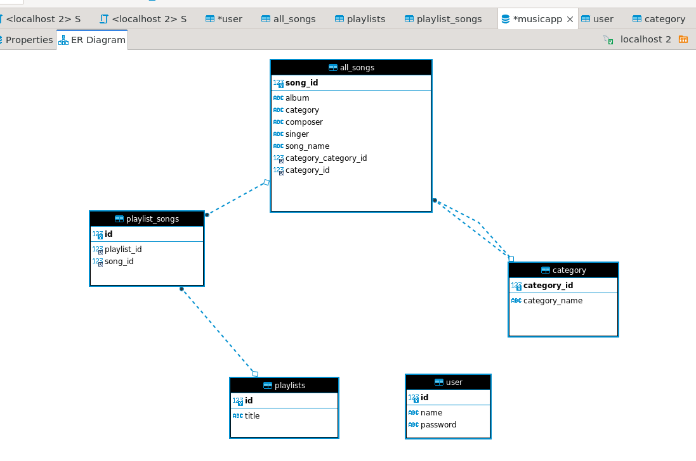

# Music App (Gastify)

## Project Description
The Music App is a modern web application that empowers users to explore, create, and manage their music playlists. Built on a robust and secure architecture, it combines a Spring Boot-based backend and an Angular-based frontend, offering a seamless and enjoyable music experience.

## Features
- Browse and Discover Music: Users can explore a vast library of songs, artists, and albums, accessing a world of music at their fingertips.

- Create and Manage Playlists: Users have the freedom to create personalized playlists, curating their favorite songs into collections for different moods, occasions, and preferences.

- Add and Remove Songs: The app enables users to add and remove songs from their playlists, giving them full control over their music selections.

- User Profiles: Users can set up profiles with customized personal statistics, making the music experience a personalized journey.

## How It Works

- Registration and Login: Users begin their journey by creating an account. They provide essential details like a unique username, a secure password. Other way of login will be login with E-mail Id from Okta. 

- Exploring Music: Once logged in, users can browse through the extensive catalog of songs available in the app. They can search for specific songs, artists, or albums, making it easy to find and discover music that resonates with them.

- Creating Playlists: Users can unleash their creativity by creating playlists. They choose a name for their playlist and start adding songs from the catalog. Playlists can be themed, from 'Morning Motivation' to 'Late-Night Chill.'

- Managing Playlists: Users can add or remove songs from their playlists as their preferences change. This flexibility ensures that playlists remain a reflection of their evolving musical taste.

- Personal Profiles: Each user has a unique profile page. They can customize their profile view their music statistics such as the number of playlists, liked songs.

## Technical Architecture

- Front-end (Angular): The user interface is built using HTML, CSS, and TypeScript. Angular provides the framework for creating dynamic and responsive web pages.

- Back-end (Spring Boot): The server-side logic is powered by Spring Boot, a Java-based framework that handles user requests, manages playlists, songs, and ensures data security.

- Database (MySQL): MySQL stores user data, songs, playlists, and other relevant information. DBeaver is used for database management.
  
## Prerequisites
- Java Development Kit (JDK)
- Spring-Boot(Maven)
- Angular CLI
- MySQL Database
- Git (for version control)

**Access the application in your web browser:**
- Open a web browser and go to `http://localhost:4200`.

## Usage
- Register and log in to your account.
- Explore the list of all available songs.
- Create new playlists.
- Add songs to your playlists.
- Remove songs from your playlists.

## APIs
- **GET /music/allSongs**: Retrieve a list of all songs.
- **GET /music/playlistSongs**: Retrieve a list of playlist songs.
- **POST /music/createPlaylist**: Create a new playlist.
- **POST /music/addToPlaylist**: Add a song to a playlist.
- **POST /music/removeFromPlaylist**: Remove a song from a playlist.

## Data Models
- **AllSongs**: Represents a song.
- **Playlists**: Represents a playlist.
- **PlaylistSongs**: Represents the relationship between songs and playlists.

## Contributing
1. **Fork the repository.**
2. **Create a new branch.**
3. **Make your changes and commit them.**
4. **Push to your fork and submit a pull request.**

## Team Members
- **Sandhya Shevatre**
- **Gaurav Hajare**
- **Ashish Sri Perambuduru**

  ## Database

  

